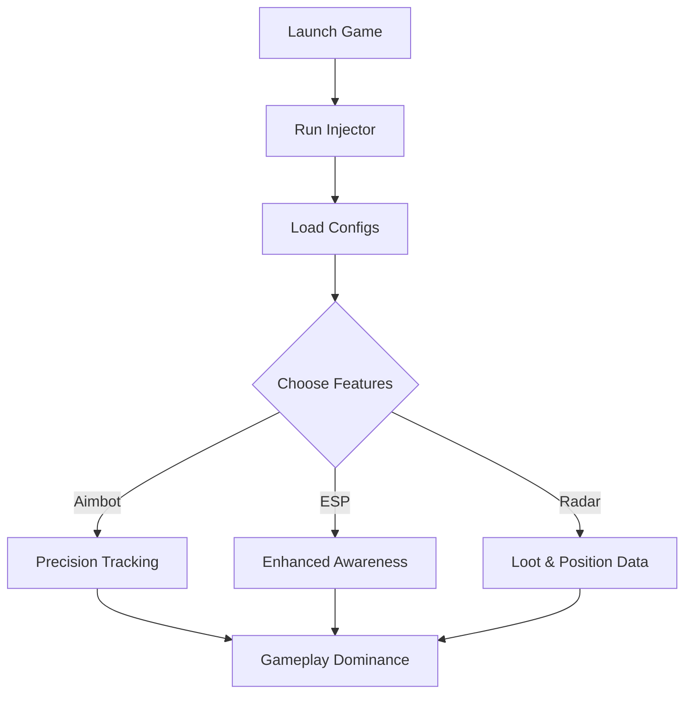

# Apex Legends Cheat Software 🎯

Step into the Apex Games with total dominance. The **Apex Legends Cheat Tool** offers pro-level enhancements like precision targeting, real-time ESP overlays, and intelligent item tracking to ensure you always have the upper hand. Whether you're climbing the ranks or just outsmarting squads, this software gives you an advantage without slowing down your system.

---

## 🧩 Overview

Built for both casual and competitive players, this cheat tool integrates seamlessly with Apex Legends to enhance gameplay awareness and aiming accuracy. It operates quietly, with configurable modules that let you tune every aspect—from aim lock sensitivity to ESP color schemes.

---

## ⚙️ Key Features

### 🎯 **Precision Aimbot**

* Adjustable smoothing & human-like delay.
* Auto-detects hitboxes for head, chest, or limbs.
* Configurable hotkey (default: `ALT`) for instant toggle.

### 👁 **ESP Wall Vision**

* Shows player outlines through obstacles.
* Health, shield, and distance indicators.
* Customizable glow colors and opacity.

### 💎 **Loot & Radar System**

* Highlights legendary and epic drops.
* Real-time minimap with enemy markers.
* Adjustable scan radius (50–250 meters).

### ⚡ **Anti-Lag Optimization**

* Direct memory injection to minimize frame loss.
* Lightweight overlay designed for 144+ FPS.

[!IMPORTANT]

> The Apex Legends Cheat is constantly updated to align with the latest Respawn patches, ensuring long-term stability and detection safety.

---

## 🖥 Compatibility

| Platform   | Status       | Notes                                |
| ---------- | ------------ | ------------------------------------ |
| Windows 10 | ✅ Supported  | Optimized for DirectX 11             |
| Windows 11 | ✅ Supported  | Auto memory offset mapping           |
| Steam      | ✅ Compatible | Full overlay functionality           |
| EA App     | ⚠️ Partial   | Requires manual launch configuration |

> **Accessibility Note:** The tool supports visual color-blind modes (Deuteranopia & Protanopia).

---

## 🧠 Setup Guide

Follow these steps to get started safely and efficiently:

1. **Download & Extract**
   Obtain the verified ZIP and extract it into a secure folder.

2. **Launch Apex Legends**
   Run the game to the main menu before activation.

3. **Run Injector**
   Open `ApexInjector.exe` as Administrator.

4. **Load Config File**
   Use your preferred `.cfg` preset or create a new one:

   ```bash
   config_load apex_smooth.cfg
   ```

5. **Activate Modules**
   Press `INS` to open the in-game menu and toggle features.

[!NOTE]

> Default settings favor accuracy and visibility balance; tweak sensitivity for snipers or SMGs as needed.

---

## 🕹 Configuration Example

```ini
[AIMBOT]
enable=true
smoothness=0.85
fov=40
priority=head
toggle_key=ALT

[ESP]
player_glow=true
show_health=true
color_mode=custom
team_color=#00BFFF
enemy_color=#FF3333
```

This flexible config allows for rapid in-game adjustments without restarts.

---

## 🧭 System Flow Diagram



---

## ❓ FAQ

**Q1: Is the cheat detectable?**
🧩 The tool uses advanced kernel-level obfuscation and dynamic memory hooks to minimize risk. Updates are rolled out after every Apex patch.

**Q2: Can I customize the hotkeys?**
Yes — every function supports custom bindings. You can remap aim toggle, ESP visibility, and radar refresh keys in `keybinds.cfg`.

**Q3: Does it work on controller input?**
Partially. The aimbot works best on mouse input, but ESP and radar function on all input types.

**Q4: What about updates after Respawn patches?**
All builds are verified post-patch within 24 hours by the development team.

**Q5: Can I use multiple configs?**
Absolutely. You can switch configs mid-session with `CTRL + F10` for testing setups.

---

## 🚀 Final Thoughts

The **Apex Legends Cheat Tool** provides an unparalleled tactical boost for players seeking consistent accuracy and situational control. Designed for flexibility and performance, it empowers both solo queue legends and team competitors.

---

*Maximize your potential. Master every firefight. Enter the Apex Games with vision and precision today.*
